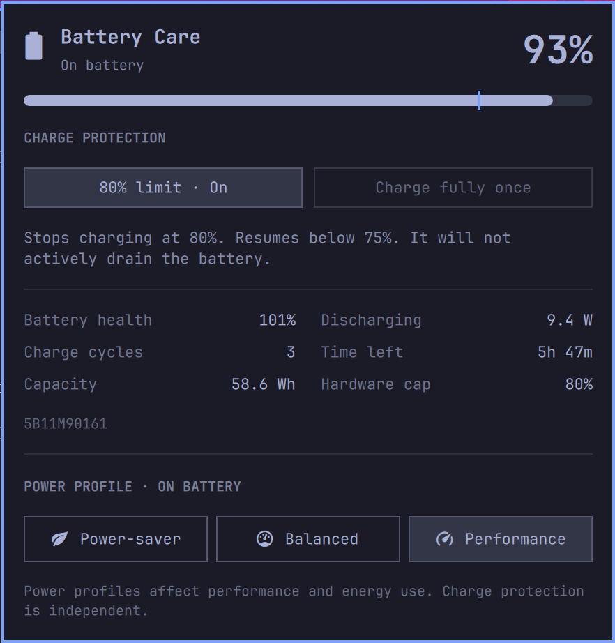

# Battery Care for Omarchy

A replacement for Omarchy’s Power widget: charge protection, a temporary full-charge session, and accurate battery information in one panel.

## Features

- **Protection toggle:** click the limit button to turn it **On** or **Off**. Off allows charging to 100% until you enable protection again; the recovery guard respects this choice across unplugging and reboot. On enables the preset supplied by UPower. On the tested ThinkPad X1 Gen 14 this is **start below 75%, stop at 80%**. Other machines show their actual preset rather than a hard-coded 80% label.
- **Charge fully once:** lifts the limit for the current plugged-in session. Protection returns after unplugging, or at the next user login after a reboot. While active, the button becomes **Cancel full charge**, which restores protection immediately, even if you have just unplugged. The protection toggle can also restore the limit.
- **Accurate status:** an available preset is never presented as enabled. Hardware limits are displayed separately; disagreements with UPower are flagged.
- **Useful telemetry:** health, cycle count, full capacity, charge/discharge power, runtime, and battery model. The charge bar marks the real active cap.
- **Power profiles:** retains Omarchy’s separately remembered plugged-in and battery profiles.
- **Screen & lock:** shared or separate battery/plugged-in screensaver and lock timeouts, presets and custom minutes/seconds, Apply/Cancel, and a Stay Awake indicator. Existing settings are inherited until you apply a change.
- **Multiple batteries:** independently selectable controls and recovery state; peripheral batteries are excluded. Unsupported batteries retain monitoring.
- **Keyboard:** arrows select available charge actions and profiles (disabled actions are skipped), Enter activates, Escape closes, `[` / `]` selects batteries, and `D` dismisses an action error. Right-click the tray icon toggles its percentage.
- **Screen settings keyboard:** `S` opens Screen & lock. Tab moves between its controls; Enter opens a selector, arrows choose a value, and Escape closes a menu or cancels the form. Unsaved drafts survive background refreshes and are discarded when the panel closes.
- **Failure visibility:** stale status disables charge actions, action errors persist until dismissed or retried, and an inactive recovery guard is reported. Small panels scroll, and narrow panels stack their controls.



## Requirements

Omarchy 4.x with its Quickshell plugin system, UPower with `EnableChargeThreshold` support for charge controls, `/usr/bin/python3`, `python-gobject`, and a systemd user session. Monitoring does not require threshold support. UPower/Polkit authorizes changes as the active desktop user; the plugin does not install privileged helpers or custom Polkit rules.

## Install

```sh
omarchy plugin add https://github.com/Dandiccf/omarchy-plugin-battery-care --enable
```

If the Python GObject dependency is missing, install it with `omarchy pkg add python-gobject`.
Enabling Battery Care replaces the standard Power widget. Charge settings change only when you choose a charge action.

## Local development install

```sh
./install-local.sh
```

The installer validates the plugin, backs up `~/.config/omarchy/shell.json`, and links this folder to `~/.config/omarchy/plugins/dandiccf.battery-care`. Enabling it replaces `omarchy.power` using Omarchy’s supported `clonedFrom` mechanism, preserving the stock IPC target and widget placement. Source stays in your development checkout. Installing alone does not change charging settings.

Choose **80% limit** (or the device’s offered protection preset) to enable protection. The first protection or temporary full-charge action installs and enables a small user timer. Turning protection Off does not require installing a timer. Development edits usually reload automatically; if Quickshell retains a cached QML error, run `omarchy restart shell` while the desktop is unlocked.

Update a git-installed copy with:

```sh
omarchy plugin update dandiccf.battery-care
```

## Recovery behavior

The first protection or temporary full-charge action creates:

- `~/.config/systemd/user/omarchy-battery-care.service`
- `~/.config/systemd/user/omarchy-battery-care.timer`
- `~/.local/state/omarchy-battery-care/state.json`

The timer checks every 15 seconds and works even if the panel is closed or the shell restarts. A durable recovery record is written **before** disabling the cap. Unplugging or a changed kernel boot ID converts a temporary full session back to protection. Failed restoration retains the record and retries; the panel displays the failure. Devices are matched using a hash of native path, model, and serial, avoiding accidental changes to a replacement battery.

State is stored in a private, user-owned directory. Managed paths must be real directories (including the ancestors of `XDG_STATE_HOME` and `XDG_CONFIG_HOME`); symlinked paths and unsafe shared-writable directories are rejected. Lock, state, and unit files must be user-owned regular files without extra hard links or group/world write access. Existing recovery units are reused only when their complete contents match this installation, including its helper path. Foreign or modified files are never overwritten or automatically removed; resolve any reported conflict before retrying. Exact units from 0.2.0 at the same installation path remain compatible.

This is a **user-session** guard. After reboot, restoration happens at login, not during firmware startup or while the machine is powered off. Very brief unplug/replug events entirely between checks may not be observed; unplug for at least one check interval or click the protection button. User-session authorization must be available for UPower to apply changes. Disabling the widget deliberately does not disable the guard or abandon a pending recovery.

Once protection is selected, the guard keeps it enabled until you switch the limit Off. Turning it Off also cancels any pending temporary full-charge recovery. If another charge manager repeatedly changes the settings, choose one owner for charge protection. Preset values are supplied by UPower; this version does not write arbitrary sysfs thresholds.

## Reading the panel

- At a current charge above the limit, protection stops further charging; it does not force battery discharge.
- “Health” is reported full capacity divided by design capacity. A new battery may show slightly above 100%; this is normal measurement/manufacturing variation, not a charging percentage.
- Runtime and power flow come from UPower and are estimates. Time to full is hidden when a charge limit is active because that estimate is not time to the limit.
- Power profile selection is independent of battery charge protection.

## Screen & lock

Open **Screen & lock** below Power profile, or press `S` with the panel open. It opens a compact settings view in the same popup; **Back**, **Cancel**, or Escape returns to the battery overview and discards unsaved edits. The popup is capped at 620 logical pixels and the available screen height, with scrolling when needed; narrow layouts stack the two power sources. Initially, both power sources inherit your existing Omarchy timeouts. Enable **Separate power-source settings** to edit battery and plugged-in values independently. The current source is highlighted. Disabling the toggle copies that source's draft values into the shared pair; previously saved separate values remain available when re-enabled.

Choose a preset or **Custom…** and enter minutes and seconds (1 second to 24 hours). Both timeouts count from the last activity: screensaver at 2 minutes and lock at 5 minutes means five minutes total, not seven. There is no Never option: Omarchy treats zero as immediate, not disabled. **Apply** saves; **Cancel** discards the draft. **Reload** discards the draft and reads the latest saved settings. Stay Awake is displayed and respected; Battery Care never changes its setting.

Omarchy's existing idle service still starts the screensaver and locks the session. Battery Care writes only the selected timeout pair and its preferences under `idle.batteryCare` in `~/.config/omarchy/shell.json`. It preserves other configuration, uses verified regular files and atomic writes, checks for concurrent changes, and makes a private `idle-shell-before-*.json` backup in its state directory before each explicit save. Invalid files and unsafe/symlinked paths are refused.

**Automatic switching waits while you are away.** Changing the stock idle service's timer intervals can restart a countdown, so Battery Care monitors power-source changes but only applies a different pair while activity is detected and Omarchy confirms no idle/lock cycle is in progress. A pending switch is shown in the panel; the old timeout pair remains in effect until you return. This preserves the existing lock deadline. Switching also works with the panel closed, while the widget is enabled. It does not require the charge-recovery timer or charge-threshold support.

If another tool edits Omarchy's timeouts, automatic switching stops and shows a conflict instead of replacing that edit. Reload the form, review its values, and Apply to resume management. Disabling/removing Battery Care stops automatic switching; Omarchy retains the last active pair and the inert saved preferences. The installed Omarchy idle service must be available for Apply.

## Revert / uninstall

Restore the standard widget:

```sh
omarchy plugin disable dandiccf.battery-care
omarchy plugin enable omarchy.power
```

For the local development install, restore the standard widget and remove its local link and recovery units with:

```sh
./uninstall-local.sh
```

For a git-managed install, first release management before using Omarchy’s plugin removal:

```sh
/usr/bin/python3 ~/.config/omarchy/plugins/dandiccf.battery-care/battery.py release
omarchy plugin remove dandiccf.battery-care
```

Release restores protection for managed protection/full-charge modes and preserves an explicit **Off** choice. It refuses to abandon an absent battery with a pending full-charge session or a failed restoration. It verifies ownership and exact contents of both recovery units before changing anything, then disables the timer, removes only those verified units, and reloads the user service manager. If release reports an error, resolve it before removing the plugin or source directory. The local uninstall script uses this same checked cleanup.

## Verification

```sh
omarchy plugin validate .
/usr/bin/python3 -m unittest discover -s tests -v
node tests/test-model.js
./tests/run-qml.sh  # Requires the Wayland session; uses a simulated battery
/usr/bin/python3 battery.py status
```

Regression coverage includes the inactive 80% preset bug, reboot and unplug recovery, canceling a full session, failed authorization and retries, replacement batteries, unsupported devices, missing telemetry, and external-manager mismatches. Live status, applying the 75–80% preset, and automatic guard restoration after temporarily disabling protection were verified on a ThinkPad X1 Gen 14. The full-charge action was also verified with the charger connected: UPower disabled protection and the hardware cap changed from 80% to 100%, with the recovery guard retaining the temporary session. Physical unplug recovery also passed: after disconnecting the charger, the running guard restored enabled protection, the 80% hardware cap, and protection mode. A physical reboot/login with protection already enabled also passed: the timer restarted successfully, and UPower and the hardware retained the 75–80% limits. Reboot recovery from an active temporary full-charge session is covered by automated tests but still needs a physical test.

## Provenance

Based on the structure and styling of Omarchy’s Power widget, installed Omarchy version 4.0.4-1. Shared `qs.Ui` components keep it aligned with the desktop theme. MIT licensed; upstream attribution is in LICENSE.

The code and usability review, including the 0.2.1 marketplace file-safety fixes and 0.3.0 Screen & lock feature, is recorded in [REVIEW.md](REVIEW.md), with test boundaries and remaining limitations.
